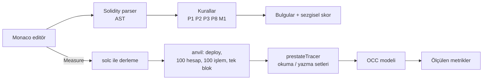

# MonadLens

Ethereum'dan Monad'a taşınan Solidity kontratlarında paralel yürütmeyi (parallel execution) kısıtlayan depolama çakışmalarını ve Monad'da farklı davranan varsayımları bulan, çakışmayı gerçek işlemlerle ölçen bir inceleme aracı.

**[Canlı demo](https://monadlens-rust.vercel.app)** · **[Gerçek kontrat bulguları](https://monadlens-rust.vercel.app/findings)**

Canlı demoda statik analiz, Fix ve **Measure parallelism → Apply & re-measure** çalışır. Arayüz Vercel'de, ölçüm servisi Railway üzerinde Docker container'ında çalışır; ölçüm için bilgisayarınıza kurulum yapmanız gerekmez. Yerel ve Docker kurulumları aşağıda alternatif olarak anlatılmıştır.

**Hızlı demo:** BadNFT'yi seçin → **Measure parallelism** → ortak sayaç bulgusunda **Fix** → diff ve Trade-offs'u inceleyin → **Apply & re-measure**. 26 Eylül 2026'da canlı Vercel API'si üzerinden yapılan 100 işlemlik doğrulamada kritik yol **100 → 9**, ideal paralellik **1× → 11,1×** çıktı. Bunlar Anvil işlem izlerinden hesaplanan OCC modeli sonuçlarıdır; Monad mainnet hız/TPS ölçümü değildir.

## Problem

Monad işlemleri iyimser paralel yürütme (optimistic parallel execution) ile çalıştırır: aynı depolama slotuna (storage slot) dokunan işlemler çakışırsa yeniden yürütülür (re-execution) ve sonuçlar blok sırasına göre birleştirilir. Ethereum için yazılmış iki yaygın kalıp burada sorun çıkarır.

**1. Global sayaç (state contention).** Her `mint` aynı slotu okuyup yazar; bloktaki tüm mint'ler sıraya girer:

```solidity
uint256 public totalSupply;

function mint() external {
    totalSupply++;                       // her çağrı aynı slotu okur ve yazar
    ownerOf[totalSupply] = msg.sender;
}
```

**2. Blok süresi varsayımı (block time assumption).** Ethereum'un blok süresine göre hesaplanmış sabitler Monad'da yanlış faiz ve vesting sonuçları üretir:

```solidity
uint256 public constant BLOCKS_PER_YEAR = 2_628_000;  // Ethereum blok süresine göre

uint256 elapsedBlocks = block.number - loan.openedAtBlock;
return loan.principal * ANNUAL_RATE_BPS * elapsedBlocks / BLOCKS_PER_YEAR / 10_000;
```

## Ne yapıyor

- **Statik analiz (static analysis).** Editöre yapıştırılan kodu AST üzerinden tarar, bulguları satır altı işaretleriyle gösterir ve bir **Heuristic Parallel Score** (sezgisel paralellik skoru, 0–100) hesaplar. Skor bir ölçüm değil, tahmindir; arayüzde de öyle etiketlenir.
- **Gerçek ölçüm (measurement).** Kontratı ölçüm sunucusunda her istek için açılan ayrı bir Anvil test düğümüne deploy eder, varsayılan olarak seçilen fonksiyonu 100 farklı hesaptan 100 kez çağırıp hepsini tek bloğa koyar ve her işlemin okuduğu/yazdığı slotları izler. Sonuç milisaniye ya da TPS değil, çakışma yapısıdır (aşağıya bakın).
- **Bedelleriyle Fix şablonları (fix templates with trade-offs).** Şablonu olan bulgularda "Fix" butonu, mevcut kod ile yamalanmış kodu yan yana gösteren bir diff açar ve şablonun bedellerini (trade-offs) listeler. "Apply & re-measure" kodu değiştirir, yeniden ölçer ve önce/sonra sonuçlarını yan yana gösterir.
- **Blok replay.** Ölçülen bağımlılık grafiği işlem başına bir nokta olarak, bağımlılık turu (dependency round) başına bir adım ilerleyen bir animasyonla oynatılır; önceki işlemlerden en az birine bağımlı olanlar kırmızı gösterilir. Fix sonrasında önce ve sonra replay'leri aynı saatle yan yana oynar. Çakışmanın tasarım gereği olduğu durumlarda (ör. AMM rezervleri) Fix önerilmez.
- **Genel güvenlik taraması (Slither).** Ayrı sekmede sunulur; Slither ve uyumlu sistem solc kurulmuş yerel/Docker ortamı gerekir. Vercel'deki sekme şu anda “General security scan runs in the local/Docker setup, see README.” mesajını gösterir; Railway'ye yönlendirme yalnızca ölçüm için bağlıdır.
- **Explain ve MCP.** Inspect içindeki Explain, bulguları açıklamak için Gemini kullanır; erişilemezse hazır açıklamaya döner. AI tespit, skor veya ölçüm üretmez. MCP sunucusu aynı analiz ve ölçüm fonksiyonlarını kod asistanlarına açar.

## Canlı kurulum

- **Vercel:** arayüz, statik analiz, Fix ve API giriş noktası.
- **Railway:** Anvil içeren Docker imajı; Vercel'in `/api/simulate` isteğini işler.
- **Bağlantı:** Vercel Production ortamında `MEASURE_SERVICE_URL=https://monadlens-production.up.railway.app`. Değişiklikten sonra Vercel yeniden deploy edilmelidir. Railway servisinin kendisinde bu değişkeni ayarlamayın; aksi halde istek yeniden uzak servise yönlenir.
- **Port:** Railway domain'inin Target Port değeri Deploy Logs'taki dinleme portuyla eşleşmelidir. Mevcut kurulum **8080** kullanır; yerel Docker Compose ise **localhost:3000** yayınlar.

Servis erişilemezse sonuç uydurulmaz: ölçüm “Not measured” durumuna geçer. Statik analiz ve Fix kullanılmaya devam edebilir.

## Nasıl çalışıyor



Her işlem için anvil'in `prestateTracer`'ı iki kez çağrılır: normal mod okunan slotları, `diffMode` değişen slotları verir (anvil'in `diffMode`'u sadece okunan slotları raporlamadığı için ikisi birlikte gerekir). OCC (optimistic concurrency control) modeli bu setlerden şunları hesaplar:

- **Bağımlılık:** Bloktaki j. işlem, kendinden önceki i. işlemin yazdığı bir slotu okuyorsa i'ye bağımlıdır.
- **Re-executions (yeniden yürütme sayısı):** En az bir bağımlılığı olan işlem sayısı.
- **Critical path (kritik yol):** Bağımlılık zincirlerinin en uzunu, işlem sayısı cinsinden. 100 işlemde 100 ise modelde tüm işlemleri kapsayan bir bağımlılık zinciri vardır; 1 ise modelin yakaladığı bir okuma–yazma bağımlılığı yoktur.
- **Ideal parallelism (ideal paralellik):** İşlem sayısı ÷ kritik yol. Ulaşılabilecek en yüksek paralellik için bir üst sınırdır.

Bu metrikler seçilen fonksiyon, girdiler ve başlangıç durumu için depolama bağımlılıklarını gösterir. Gerçek Monad zamanlayıcısının performans garantisi veya güvenlik denetimi değildir. Ölçülmemiş hiçbir süre, TPS ya da hızlanma süresi gösterilmez.

## Ölçülen sonuçlar

Anvil 1.5.1 ve solc-js 0.8.37 ile, her satır 100 işlem ve 100 farklı gönderici. BadNFT öncesi/sonrası değerleri 26 Eylül 2026’da canlı Vercel → Railway akışında yeniden doğrulandı; AMMPool satırı yerel doğrulama sonucudur.

| Kontrat · fonksiyon | Kritik yol | Re-executions | İdeal paralellik | Ort. gas | Sıcak slot |
|---|---|---|---|---|---|
| BadNFT · `mint()` | 100 | 99 | 1.0× | 48,765 | `totalSupply` |
| BadNFT, sharded-counter Fix sonrası · `mint()` | **9** | 84 | 11.1× | 59,654 | `_shardCounts[3]`, `_activeByShard[3]` (9'ar yazma) |
| AMMPool · `swap(bool,uint256)` | 100 | 99 | 1.0× | 31,364 | `reserve0`, `reserve1` |

- Sharded counter Fix'i kritik yolu 100'den 9'a indiriyor; buna karşılık her mint iki shard sayacı yazdığı için ortalama gas 48,765'ten 59,654'e, önerilen gas limiti 72,264'ten 97,221'e çıkıyor. Monad gas'ı kullanılan miktardan değil gas limitinden ücretlendirdiği için arayüz önerilen gas limitini ayrıca gösterir.
- AMMPool'da çakışma tasarım gereğidir: her swap aynı rezerv çiftini güncellemek zorundadır. MonadLens bunu P8 olarak "bilgi" seviyesinde gösterir ve Fix önermez.

Tekrarlamak için canlı demoda veya aşağıdaki yerel/Docker kurulumunda kontratı seçip **Measure parallelism**'e basın. BadNFT'te **Fix → Apply & re-measure** önce/sonra karşılaştırmasını verir.

## Ölçümü yerelde çalıştırma

Gereksinimler: Node.js 20.9 veya üstü ve Foundry (Anvil). Docker ile eşleşen kurulum Node.js 22.20.0/npm 10.9.3 kullanır. Statik analiz için Anvil gerekmez.

Foundry'yi kurun:

```bash
curl -L https://foundry.paradigm.xyz | bash
```

```bash
foundryup
```

```bash
anvil --version
```

Proje dizininde:

```bash
npm ci
```

```bash
npm run dev
```

Ardından http://localhost:3000 adresini açın. Uygulama anvil'i önce `ANVIL_PATH` ortam değişkeninde, sonra `~/.foundry/bin/anvil`'de, en son `PATH` üzerinde arar. anvil bulunamazsa ölçüm paneli "Not measured" ve nedenini gösterir; statik analiz çalışmaya devam eder.

Diğer komutlar:

```bash
npm test
```

```bash
node scripts/probe-prestate-tracer.mjs
```

İlki kuralları, OCC modelini ve şablonları test eder (vitest). İkincisi yüklü anvil'in `prestateTracer` desteğini kontrol eder.

## Docker ile çalıştırma

Docker Compose; Node.js uygulamasını, Anvil 1.5.1'i, Slither 0.11.4'ü ve Slither'ın kullandığı sistem `solc` 0.8.30'u tek imajda kurar. Kontrat ölçümü sistem `solc` yerine npm paketindeki solc-js 0.8.37'yi kullanır:

```bash
docker compose up --build
```

Uygulama [http://localhost:3000](http://localhost:3000) adresinde açılır. Derleyiciler ve analiz araçları imaj oluşturulurken kurulur.

İmaj `linux/amd64` olarak sabitlenmiştir; Apple Silicon bilgisayarlarda ilk build emülasyon nedeniyle uzun sürebilir. Compose, `localhost:3000` portunu yayınlayabilmek için standart bridge ağı kullanır ve tek başına runtime egress'i engellemez. Servisi internete açmadan önce Railway/Fly/Render ağ politikası veya host firewall ile container'ın dış bağlantılarını kapatın. Slither, solc ve Anvil imajda hazırdır; farklı pragma sürümleri için otomatik derleyici indirmeye güvenmeyin. Ölçüm solc-js 0.8.37, Slither sistem solc 0.8.30 ile uyumlu kaynak gerektirir.

## MCP sunucusu

MCP sunucusu `analyze_contract(source)` ile statik bulguları ve sezgisel skoru, `measure_contract(source, txCount)` ile yerel Anvil ölçümünü sunar. Kurulumdan sonra sunucuyu doğrudan çalıştırabilirsiniz:

```bash
npm run mcp
```

Claude Code'a proje yolunu kullanarak ekleyin:

```bash
claude mcp add monadlens -- npm --prefix /absolute/path/to/monadlens run mcp
```

Codex için `~/.codex/config.toml` dosyasına ekleyin:

```toml
[mcp_servers.monadlens]
command = "npm"
args = ["--prefix", "/absolute/path/to/monadlens", "run", "mcp"]
```

`measure_contract` için Foundry/Anvil gerekir. Gerekirse MCP yapılandırmasında `ANVIL_PATH` ortam değişkenini Anvil ikilisinin tam yoluna ayarlayın.

## Kurallar

| Kod | Ne yakalar | Şiddet | Fix |
|---|---|---|---|
| P1_GLOBAL_COUNTER | Mapping olmayan bir state değişkeninde sabit artış: `x++`, `x += 1` | critical | sharded counter |
| P2_ARRAY_PUSH | Depolamadaki dinamik diziye `.push()`, `ERC721Enumerable` kalıtımı | high | yok (henüz şablon yok) |
| P3_GLOBAL_ACCUMULATOR | Çağrı başına miktar biriktirme: `protocolFees += fee` | high | yok (henüz şablon yok) |
| P8_INHERENT | AMM rezervleri gibi tasarım gereği çakışan yazmalar | info | bilerek yok |
| C1_REENTRANCY_GUARD | Reentrancy guard içindeki depolama yazmaları | info | yok |
| M1_BLOCK_TIME_ASSUMPTION | `2628000`, `2102400`, `7200` gibi sabitler, `BLOCKS_PER_*` adları, `block.number` ile aritmetik | critical | saniye bazlı süre (`block.timestamp`) |

Bilerek işaretlenmeyen durumlar (yanlış alarm filtreleri): `msg.sender` anahtarlı mapping yazmaları (her kullanıcı kendi slotuna yazar); `view`/`pure` fonksiyonlar; admin kısıtlı fonksiyonlardaki P1–P5 bulguları (`onlyOwner`, `onlyRole` gibi modifier'lar ya da ilk satırda `require(msg.sender == owner)`), çünkü bunları yalnızca yöneticiler çağırır.

## Sınırlamalar

- **Tek dosya.** `import` çözülmez; kontratın düzleştirilmiş (flattened) hali gerekir. Ölçümde `contractName` verilmezse kaynak sırasındaki son somut kontrat seçilir.
- **Basit argümanlar.** Ölçümde fonksiyon ve constructor argümanları yer tutucularla doldurulur: `uint` → 1000 (tipin üst sınırına kısılır), `address` → gönderen hesap, `bool` → true, `bytes32` → sıfır. `string`, dizi ve struct argümanları desteklenmez; işlemlerin yarısından fazlası revert ederse sonuç "Not measured" olur.
- **Sadeleştirilmiş OCC modeli.** Model yalnızca okuma–yazma çakışmalarını sayar ve Monad'ın gerçek zamanlayıcısının (scheduler) sadeleştirilmiş bir halidir; kritik yol bağımlılık zinciri uzunluğudur; ideal paralellik model içindeki bir üst sınırdır, gerçek süre değildir. Tek seferde tek fonksiyon ölçülür.
- **Canlı servis sınırları.** `/api/simulate` 2–200 işlem, 50.000 karakter kaynak ve 256 KiB bildirilen gövde sınırı uygular; derleme 20 saniye, ölçüm 60 saniye ile sınırlıdır. Her ölçüm ayrı Anvil süreci kullanır. İşlem belleğinde tutulan IP anahtarlı limit 10 istek/dakikadır; birden fazla sunucu için ortak kota değildir. Vercel → Railway arasında gerçek istemci IP'sini güvenilir aktarmak için iki tarafta aynı `MEASURE_SERVICE_TOKEN` gerekir; mevcut canlı kurulumda bu henüz yapılandırılmadığından Railway tarafındaki kota proxy IP'sinde paylaşılabilir.
- **Güvenlik izolasyonu tamamlanmış değildir.** Railway'de istek sırasında dış ağ erişiminin engellendiği doğrulanmadı; Docker Compose da bunu tek başına sağlamaz. `/api/security` üzerinde kaynak boyutu ve zaman sınırı vardır, IP kotası henüz bağlı değildir. Canlı demo, tam izolasyonlu üretim ortamı olarak değerlendirilmemelidir.
- **Sezgisel kurallar.** P8 rezervleri değişken adından tanır; admin tespiti modifier adlarını ve fonksiyon başındaki desteklenen erişim kontrollerini inceler. Skor bir kanıt değildir.
- **Şablonlar belirli kalıpları yamalar.** Fix, kontratın yalnızca ilgili bildirimlerini ve hesaplarını değiştirir (ör. BadNFT'te `burn`, BadLending'de `borrow` ve `Loan` korunur); tanımadığı bir kod şeklinde diff açılmaz.

## Yol haritası

- Foundry testlerinden ölçüm senaryosu üretmek (yer tutucu argümanlar yerine gerçek çağrı dizileri).
- CLI ve GitHub Action: pull request'lerde analiz ve ölçüm.
- Canlı Slither yönlendirmesi; güvenlik uç noktasına IP limiti.
- Container dış ağ kısıtlaması ve dağıtık istek kotası; ölçüm proxy'sinde güvenilir istemci IP aktarımı.
- Kalan kurallar: P4–P7 ve M2–M5.
