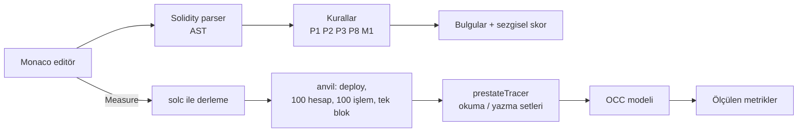

# MonadLens

Ethereum'dan Monad'a taşınan Solidity kontratlarında paralel yürütmeyi (parallel execution) kısıtlayan depolama çakışmalarını ve Monad'da farklı davranan varsayımları bulan, çakışmayı gerçek işlemlerle ölçen bir inceleme aracı.

**Canlı:** https://monadlens-rust.vercel.app (statik analiz ve Fix şablonları çalışır; ölçüm yalnızca yerelde, bkz. [Ölçümü yerelde çalıştırma](#ölçümü-yerelde-çalıştırma))

## Problem

Monad işlemleri iyimser paralel yürütme (optimistic parallel execution) ile çalıştırır: aynı depolama slotuna (storage slot) dokunan işlemler çakışırsa yeniden yürütülür (re-execution) ve sonuçlar blok sırasına göre birleştirilir. Ethereum için yazılmış iki yaygın kalıp burada sorun çıkarır.

**1. Global sayaç (state contention).** Her `mint` aynı slotu okuyup yazar; bloktaki tüm mint'ler sıraya girer:

```solidity
uint256 public totalSupply;

function mint() external {
    totalSupply++;                       // her çağrı aynı slotu okur ve yazar
    ownerOf[totalSupply] = msg.sender;
}
```

**2. Blok süresi varsayımı (block time assumption).** Ethereum'un blok süresine göre hesaplanmış sabitler Monad'da yanlış faiz ve vesting sonuçları üretir:

```solidity
uint256 public constant BLOCKS_PER_YEAR = 2_628_000;  // Ethereum blok süresine göre

uint256 elapsedBlocks = block.number - loan.openedAtBlock;
return loan.principal * ANNUAL_RATE_BPS * elapsedBlocks / BLOCKS_PER_YEAR / 10_000;
```

## Ne yapıyor

- **Statik analiz (static analysis).** Editöre yapıştırılan kodu AST üzerinden tarar, bulguları satır altı işaretleriyle gösterir ve bir **Heuristic Parallel Score** (sezgisel paralellik skoru, 0–100) hesaplar. Skor bir ölçüm değil, tahmindir; arayüzde de öyle etiketlenir.
- **Gerçek ölçüm (measurement).** Kontratı yerel bir anvil düğümüne deploy eder, seçilen fonksiyonu 100 farklı hesaptan 100 kez çağırıp hepsini tek bloğa koyar ve her işlemin okuduğu/yazdığı slotları izler. Sonuç milisaniye ya da TPS değil, çakışma yapısıdır (aşağıya bakın).
- **Bedelleriyle Fix şablonları (fix templates with trade-offs).** Şablonu olan bulgularda "Fix" butonu, mevcut kod ile yamalanmış kodu yan yana gösteren bir diff açar ve şablonun bedellerini (trade-offs) listeler. "Apply & re-measure" kodu değiştirir, yeniden ölçer ve önce/sonra sonuçlarını yan yana gösterir.
- **Blok replay.** Ölçülen bağımlılık grafiği 100 nokta olarak, bağımlılık turu (dependency round) başına bir adım ilerleyen bir animasyonla oynatılır; bir önceki işlemle çakışanlar kırmızı yanar. Fix sonrasında önce ve sonra replay'leri aynı saatle yan yana oynar. Çakışmanın tasarım gereği olduğu durumlarda (ör. AMM rezervleri) Fix önerilmez.

## Nasıl çalışıyor



Her işlem için anvil'in `prestateTracer`'ı iki kez çağrılır: normal mod okunan slotları, `diffMode` değişen slotları verir (anvil'in `diffMode`'u sadece okunan slotları raporlamadığı için ikisi birlikte gerekir). OCC (optimistic concurrency control) modeli bu setlerden şunları hesaplar:

- **Bağımlılık:** Bloktaki j. işlem, kendinden önceki i. işlemin yazdığı bir slotu okuyorsa i'ye bağımlıdır.
- **Re-executions (yeniden yürütme sayısı):** En az bir bağımlılığı olan işlem sayısı.
- **Critical path (kritik yol):** Bağımlılık zincirlerinin en uzunu, işlem sayısı cinsinden. 100 işlemde 100 ise blok tamamen seridir, 1 ise tamamen paraleldir.
- **Ideal parallelism (ideal paralellik):** İşlem sayısı ÷ kritik yol. Ulaşılabilecek en yüksek paralellik için bir üst sınırdır.

Milisaniye ya da TPS yerine bu metrikleri kullanıyoruz: bunlar donanımdan ve düğüm ayarlarından bağımsızdır ve kontratın kendisinden kaynaklanan çakışmayı doğrudan gösterir. Ölçülmemiş hiçbir süre ya da hız rakamı gösterilmez.

## Ölçülen sonuçlar

anvil 1.5.1 ve solc 0.8.37 ile, her satır 100 işlem ve 100 farklı gönderici; iki ayrı çalıştırmada aynı sonuç alındı.

| Kontrat · fonksiyon | Kritik yol | Re-executions | İdeal paralellik | Ort. gas | Sıcak slot |
|---|---|---|---|---|---|
| BadNFT · `mint()` | 100 | 99 | 1.0× | 48,765 | `totalSupply` |
| BadNFT, sharded-counter Fix sonrası · `mint()` | **9** | 84 | 11.1× | 59,654 | `_shardCounts[3]`, `_activeByShard[3]` (9'ar yazma) |
| AMMPool · `swap(bool,uint256)` | 100 | 99 | 1.0× | 31,364 | `reserve0`, `reserve1` |

- Sharded counter Fix'i kritik yolu 100'den 9'a indiriyor; buna karşılık her mint iki shard sayacı yazdığı için ortalama gas 48,765'ten 59,654'e, önerilen gas limiti 72,264'ten 97,221'e çıkıyor. Monad gas'ı kullanılan miktardan değil gas limitinden ücretlendirdiği için arayüz önerilen gas limitini ayrıca gösterir.
- AMMPool'da çakışma tasarım gereğidir: her swap aynı rezerv çiftini güncellemek zorundadır. MonadLens bunu P8 olarak "bilgi" seviyesinde gösterir ve Fix önermez.

Tekrarlamak için: aşağıdaki gibi yerelde çalıştırın, demo kontratını seçin, **Measure**'a basın; BadNFT'te **Fix → Apply & re-measure** önce/sonra tablosunu verir.

## Ölçümü yerelde çalıştırma

Gereksinimler: Node.js 20.9 veya üstü ve Foundry (anvil).

Foundry'yi kurun:

```bash
curl -L https://foundry.paradigm.xyz | bash
```

```bash
foundryup
```

```bash
anvil --version
```

Proje dizininde:

```bash
npm install
```

```bash
npm run dev
```

Ardından http://localhost:3000 adresini açın. Uygulama anvil'i önce `ANVIL_PATH` ortam değişkeninde, sonra `~/.foundry/bin/anvil`'de, en son `PATH` üzerinde arar. anvil bulunamazsa ölçüm paneli "Not measured" ve nedenini gösterir; statik analiz çalışmaya devam eder.

Diğer komutlar:

```bash
npm test
```

```bash
node scripts/probe-prestate-tracer.mjs
```

İlki kuralları, OCC modelini ve şablonları test eder (vitest). İkincisi yüklü anvil'in `prestateTracer` desteğini kontrol eder.

## Docker ile çalıştırma

Docker Compose; Node.js uygulamasını, Anvil 1.5.1'i, Slither 0.11.4'ü ve Slither'ın kullandığı sistem `solc` 0.8.30'u tek imajda kurar. Kontrat ölçümü sistem `solc` yerine npm paketindeki solc-js 0.8.37'yi kullanır:

```bash
docker compose up --build
```

Uygulama [http://localhost:3000](http://localhost:3000) adresinde açılır. Derleyiciler ve analiz araçları imaj oluşturulurken kurulur.

İmaj `linux/amd64` olarak sabitlenmiştir; Apple Silicon bilgisayarlarda ilk build emülasyon nedeniyle uzun sürebilir. Compose, `localhost:3000` portunu yayınlayabilmek için standart bridge ağı kullanır ve tek başına runtime egress'i engellemez. Servisi internete açmadan önce Railway/Fly/Render ağ politikası veya host firewall ile container'ın dış bağlantılarını kapatın. Slither, solc ve Anvil imajda hazırdır; istek işlenirken araç indirilmez.

## MCP sunucusu

MCP sunucusu `analyze_contract(source)` ile statik bulguları ve sezgisel skoru, `measure_contract(source, txCount)` ile yerel Anvil ölçümünü sunar. Kurulumdan sonra sunucuyu doğrudan çalıştırabilirsiniz:

```bash
npm run mcp
```

Claude Code'a proje yolunu kullanarak ekleyin:

```bash
claude mcp add monadlens -- npm --prefix /absolute/path/to/monadlens run mcp
```

Codex için `~/.codex/config.toml` dosyasına ekleyin:

```toml
[mcp_servers.monadlens]
command = "npm"
args = ["--prefix", "/absolute/path/to/monadlens", "run", "mcp"]
```

`measure_contract` için Foundry/Anvil gerekir. Gerekirse MCP yapılandırmasında `ANVIL_PATH` ortam değişkenini Anvil ikilisinin tam yoluna ayarlayın.

## Kurallar

| Kod | Ne yakalar | Şiddet | Fix |
|---|---|---|---|
| P1_GLOBAL_COUNTER | Mapping olmayan bir state değişkeninde sabit artış: `x++`, `x += 1` | critical | sharded counter |
| P2_ARRAY_PUSH | Depolamadaki dinamik diziye `.push()`, `ERC721Enumerable` kalıtımı | high | yok (henüz şablon yok) |
| P3_GLOBAL_ACCUMULATOR | Çağrı başına miktar biriktirme: `protocolFees += fee` | high | yok (henüz şablon yok) |
| P8_INHERENT | AMM rezervleri gibi tasarım gereği çakışan yazmalar | info | bilerek yok |
| M1_BLOCK_TIME_ASSUMPTION | `2628000`, `2102400`, `7200` gibi sabitler, `BLOCKS_PER_*` adları, `block.number` ile aritmetik | critical | saniye bazlı süre (`block.timestamp`) |

Bilerek işaretlenmeyen durumlar (yanlış alarm filtreleri): `msg.sender` anahtarlı mapping yazmaları (her kullanıcı kendi slotuna yazar); `view`/`pure` fonksiyonlar; admin kısıtlı fonksiyonlardaki P1–P5 bulguları (`onlyOwner`, `onlyRole` gibi modifier'lar ya da ilk satırda `require(msg.sender == owner)`), çünkü bunları yalnızca yöneticiler çağırır.

## Sınırlamalar

- **Tek dosya.** `import` çözülmez; kontratın düzleştirilmiş (flattened) hali gerekir. Dosyadaki son kontrat deploy edilir.
- **Basit argümanlar.** Ölçümde fonksiyon ve constructor argümanları yer tutucularla doldurulur: `uint` → 1000 (tipin üst sınırına kısılır), `address` → gönderen hesap, `bool` → true, `bytes32` → sıfır. `string`, dizi ve struct argümanları desteklenmez; işlemlerin yarısından fazlası revert ederse sonuç "Not measured" olur.
- **Sadeleştirilmiş OCC modeli.** Model yalnızca okuma–yazma çakışmalarını sayar ve Monad'ın gerçek zamanlayıcısının (scheduler) sadeleştirilmiş bir halidir; kritik yol ve ideal paralellik üst sınırdır, gerçek süre değildir. Tek seferde tek fonksiyon ölçülür.
- **Ölçüm canlıda kapalı.** anvil ve solc sistem süreci gerektirdiği için Vercel'de çalışmaz; canlı sitede Measure bu nedeni gösterir. Ölçüm servisinde IP başına istek limiti henüz yok, bu yüzden internete açılmamalı.
- **Sezgisel kurallar.** P8 rezervleri değişken adından tanır; admin tespiti modifier adına bakar. Skor bir kanıt değildir.
- **Şablonlar belirli kalıpları yamalar.** Fix, kontratın yalnızca ilgili bildirimlerini ve hesaplarını değiştirir (ör. BadNFT'te `burn`, BadLending'de `borrow` ve `Loan` korunur); tanımadığı bir kod şeklinde diff açılmaz.

## Yol haritası

- Foundry testlerinden ölçüm senaryosu üretmek (yer tutucu argümanlar yerine gerçek çağrı dizileri).
- CLI ve GitHub Action: pull request'lerde analiz ve ölçüm.
- Slither ile genel güvenlik taraması (ayrı sekme).
- MCP sunucusu: AI kod asistanlarının analiz ve ölçümü doğrudan çağırması.
- Kalan kurallar: P4–P7 ve M2–M5.
